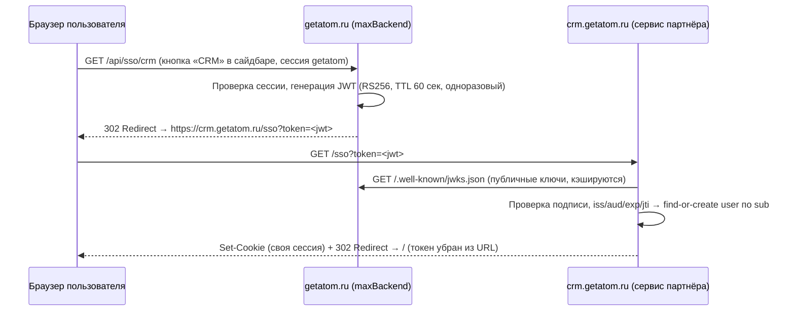

# getatom SSO Handoff

Спецификация бесшовной авторизации пользователей getatom.ru во внешних сервисах-партнёрах (whitelabel), размещённых на поддоменах вида `crm.getatom.ru`.

Принцип: **getatom — единственный источник авторизации**. Партнёр не получает ни куки, ни пароли, ни email/телефон — только короткоживущий подписанный JWT с псевдонимным идентификатором пользователя.

## Как это работает

Для пользователя это один клик: нажал «CRM» — оказался внутри уже авторизованным.

## Ключевые свойства

| Свойство | Как обеспечено |
|---|---|
| Партнёр не видит учётные данные | Куки getatom host-only, наружу уходит только JWT |
| Партнёр не видит персональные данные | В токене псевдонимный UUID (`sub`) и опционально имя; email/телефона нет |
| Токен нельзя подделать | RS256: приватный ключ только у getatom, партнёр проверяет по JWKS |
| Токен нельзя переиспользовать | TTL 60 секунд + одноразовый `jti` (replay protection на стороне партнёра) |
| Ключи можно ротировать | JWKS с `kid`, партнёр кэширует и перечитывает ключи |

## Структура репозитория

- [docs/jwt-spec.md](docs/jwt-spec.md) — формат токена: claims, подпись, время жизни
- [docs/getatom-provider.md](docs/getatom-provider.md) — реализация на стороне getatom (Java / Spring Boot)
- [docs/vendor-consumer.md](docs/vendor-consumer.md) — **требования и инструкция для партнёра**: эндпоинт `/sso`, проверки, сессия
- [docs/security-checklist.md](docs/security-checklist.md) — чеклист безопасности для обеих сторон
- [examples/vendor-node/](examples/vendor-node/) — **рабочий пример интеграции** на Node.js/Express: принимает `/sso?token=<jwt>`, проверяет и создаёт сессию

## Быстрый старт для партнёра

1. Прочитать [docs/vendor-consumer.md](docs/vendor-consumer.md).
2. Запустить пример: `cd examples/vendor-node && npm install && npm start` — он поднимает `/sso?token=` и мок-issuer для локальной проверки без getatom.
3. Реализовать то же самое в своём стеке (проверки перечислены в спеке, библиотеки JWT есть под любой язык).
4. Прислать нам URL своего `/sso`-эндпоинта и получить от нас `aud` и адрес JWKS.

## Что за рамками этой спеки

Данные, которые пользователи создают внутри сервиса партнёра (лиды, контакты), хранятся у партнёра. Требования к их обработке, экспорту и удалению фиксируются договором (DPA), а не этим протоколом.
