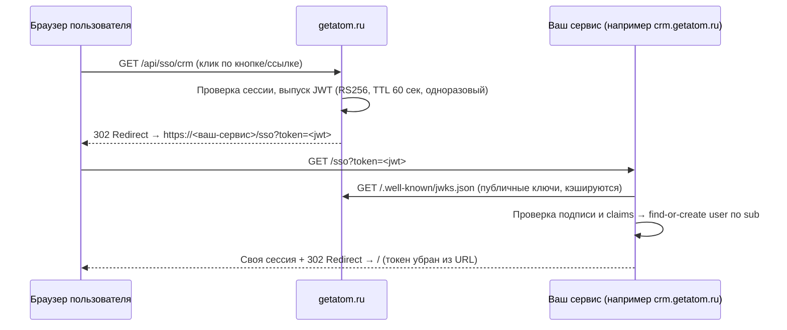

# getatom SSO Handoff

Бесшовный вход через getatom для сервисов-партнёров: пользователь нажимает одну кнопку — и оказывается в вашем сервисе уже авторизованным, без формы логина и без пароля.

Как это устроено: getatom выпускает короткоживущий подписанный токен (JWT) и передаёт его вашему сервису через redirect. В токене — стабильный ID пользователя и его имя: ровно то, что нужно, чтобы создать аккаунт и открыть сессию. Вам не нужно делать свою систему авторизации, хранить пароли или обрабатывать лишние персональные данные.

## Как это работает

Если пользователь ещё не залогинен в getatom (например, пришёл с вашего лендинга по кнопке «Войти через getatom»), он сначала увидит логин getatom, а после входа автоматически продолжит тот же поток и попадёт к вам.

## Что вы получаете

| | |
|---|---|
| **Вход в один клик** | Пользователь getatom попадает к вам уже авторизованным — меньше отвалов на входе |
| **Не нужна своя авторизация** | Ни паролей, ни восстановления доступа, ни SMS — всё это остаётся на стороне getatom |
| **Минимум персональных данных** | В токене стабильный ID (`sub`) и имя — меньше ПДн, меньше комплаенс-нагрузки на ваш сервис |
| **Простая проверка** | Стандартный JWT RS256 + JWKS — библиотеки есть под любой язык, интеграция обычно занимает день |
| **Надёжность** | Токен живёт 60 секунд и одноразовый — перехваченная ссылка бесполезна |

## Какой домен нужен вашему сервису

Любой. Протокол не привязан к конкретному хосту: адрес приёма токена и `aud` задаются конфигурацией на стороне getatom. Варианты:

- **Поддомен getatom** (например `crm.getatom.ru`) — ваш сервис выглядит частью экосистемы АТОМ; домен направляется на ваш хостинг через CNAME.
- **Ваш собственный домен** — тоже работает без изменений в протоколе; сообщите нам хост и адрес вашего `/sso`-эндпоинта.

## Структура репозитория

- [docs/vendor-consumer.md](docs/vendor-consumer.md) — **главный документ для интеграции**: эндпоинт `/sso`, проверки, сессия
- [docs/jwt-spec.md](docs/jwt-spec.md) — формат токена: claims, подпись, время жизни
- [docs/security-checklist.md](docs/security-checklist.md) — чек-лист безопасности для обеих сторон
- [docs/getatom-provider.md](docs/getatom-provider.md) — как устроена сторона getatom (для справки)
- [examples/vendor-node/](examples/vendor-node/) — **рабочий пример** на Node.js/Express: принимает `/sso?token=<jwt>`, проверяет и создаёт сессию; включает мок-issuer для локальной разработки без getatom

## Быстрый старт

1. Прочитайте [docs/vendor-consumer.md](docs/vendor-consumer.md).
2. Запустите пример: `cd examples/vendor-node && npm install && npm start` — полный цикл SSO работает локально, без доступа к getatom.
3. Реализуйте то же самое в своём стеке (все проверки перечислены в спеке, JWT-библиотеки есть под любой язык — таблица в README примера).
4. Пришлите нам хост сервиса и URL вашего `/sso`-эндпоинта — мы включим сервис в конфиг и пришлём финальные `aud` и адрес JWKS.

## Вопросы за рамками протокола

Данные, которые пользователи создают внутри вашего сервиса (лиды, контакты и т.д.), хранятся у вас — порядок их обработки, экспорта и удаления фиксируем договором отдельно.
